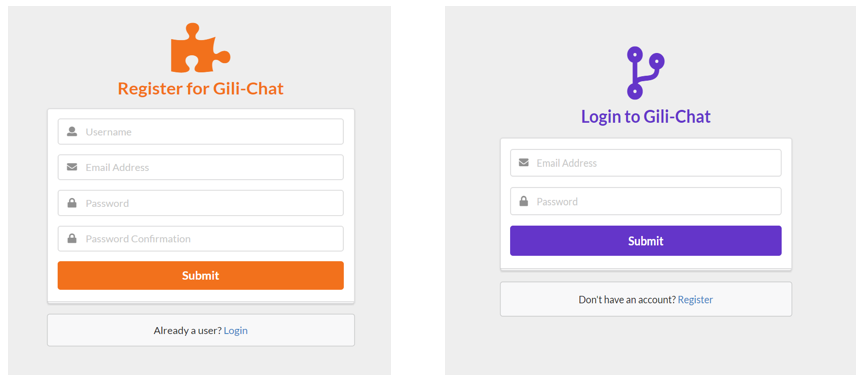
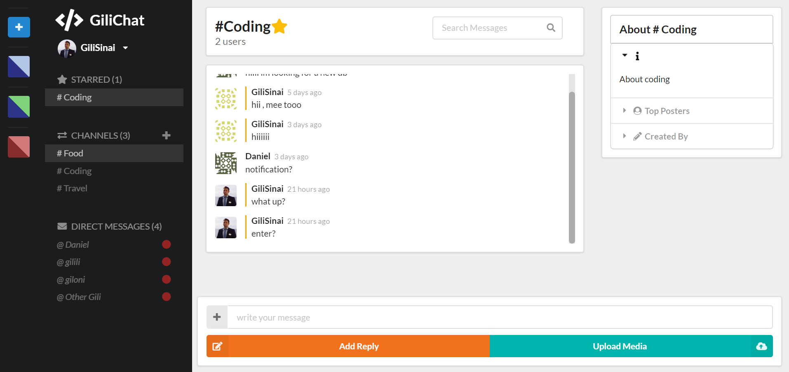
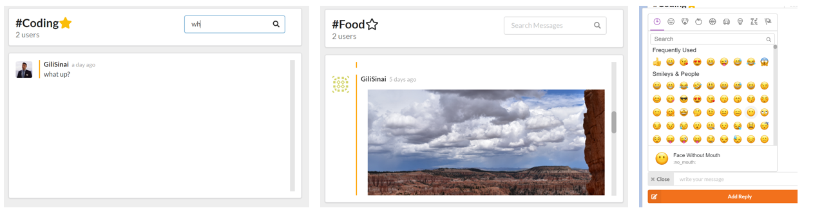
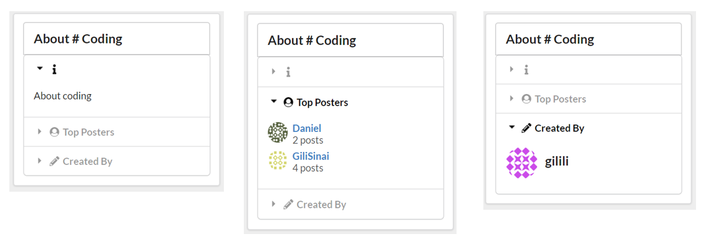
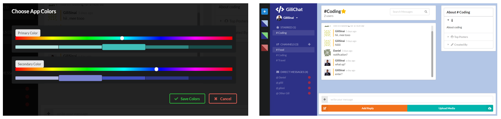

# Table Of Contents

- [Gili-Chat](#gili-chat)
  - [Running the project](#running-the-project)
  - [Screenshots](#screenshots)
    - [Login or Register](#login-or-register)
    - [Main Dashboard](#main-dashboard)
    - [Messages Features](#messages-features)
    - [About](#about)
    - [Change Avatar](#change-avatar)
    - [Change App Colors](#change-app-colors)
  - [Techstack](#tech-stack)
  - [TODO](#todo)

# Gili-Chat

Gili-Chat is a full-stack chat app built with React. Users are able to send messages or images on public/private channels. Able to choose and edit their profile pictures and theme colors of the app.

Demo: https://gili-chat.firebaseapp.com/

## Table Of Contents

## Running the project

1. Clone the repo.
2. Run `npm install`.
3. Run `npm start`.

## Screenshots

### Login or Register

Main screen for users to login or register if they are not a users already.

### Main Dashboard

A user can see whos currently conncted, have a chat area and a side metadata panel about the current channel.

### Messages Features

A user can send regular text messages or images,send emojis and search for messages that was already sent.  

### About 

Once a user on a public channel he cam see details about the channels, general information, top posters and by who the channel was created by.

### Change Avatar

A user can change his default avatar image , corp the image if needed and save it as its profile picture.

### Change App Colors

There is a side panel available for the user to change is app colors and save different pallets of them.

## Techstack

- React with Redux
- Firebase
- NodeJS
- Semantic UI React for design

## TODO

1. Add an edit user info section.
2. Make the app mobile responsive.

